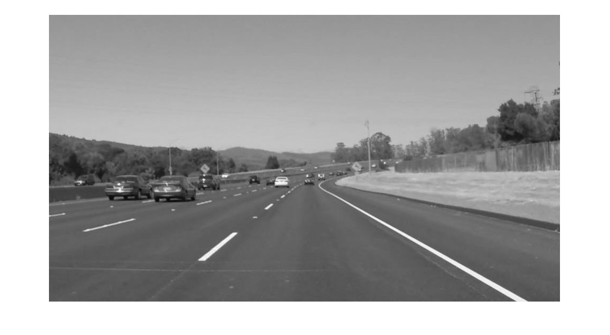

# Lane_Detection_tutorial
This tutorial teaches the basics on lane detection algorithm. Every image 
processing pipeline is slightly different, however, this should serve as a 
guideline for your future algorithm. 

## Image Gray scale
Most of the work involving lane detection doesn't need the colour information as there is a clear contrast between the line and the road.
Therefore we can apply a gray scale transform: 
$$G_xy = {(R_{xy}+G_{xy}+B_{xy}) \over 3}$$
Where (x,y) represents the pixel location.

<figure>
  
  <figcaption>Gray Scale image</figcaption>
</figure>

## ROI cropping
ROI (Region of Interest) is the area we are interesting in performing  part or all of our image processing pipeline.  
In the case of our road, the main region is the bottom half of the image as it contains road information. We can extend this further on only look ahead. This will allow us to filter unwanted noise. 

## Birds Eye View or Homomorphic Mapping
Depending on your application it might be easier to visualize the road as if you were looking from above.  
Given:
$$s =\begin{bmatrix}x_{1}\\
y_{1}\\
1 
\end{bmatrix}, d = \begin{bmatrix}x_{2}\\
y_{2}\\
1 
\end{bmatrix}$$
Source $s$ and destination $d$ (the extra dimension is to be able to perform translation and rotation using Matrix Multiplication)

