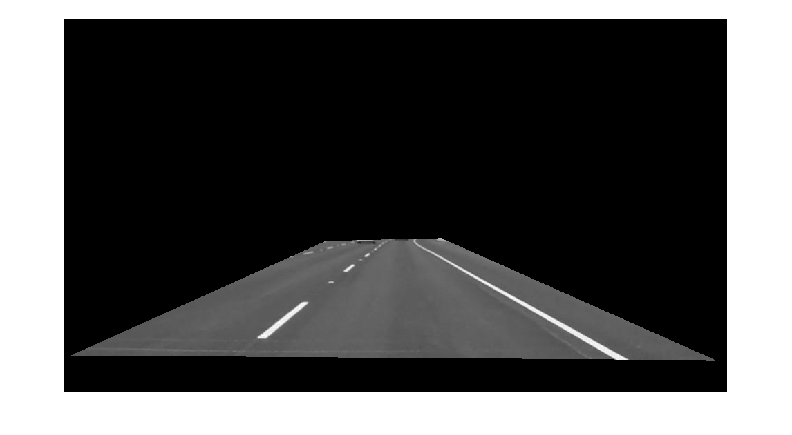
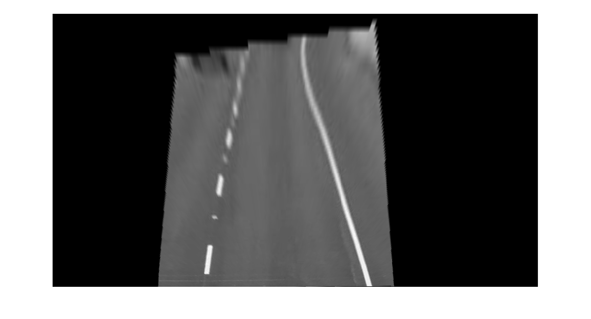
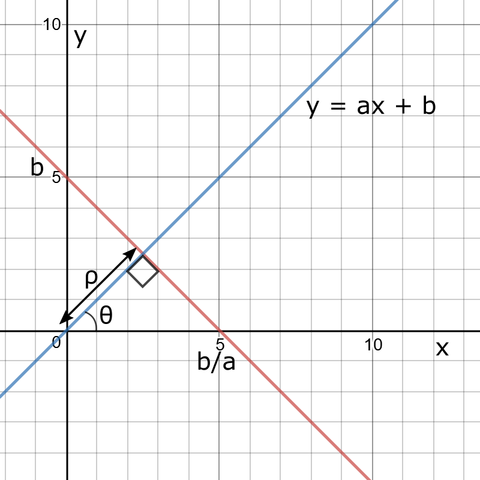
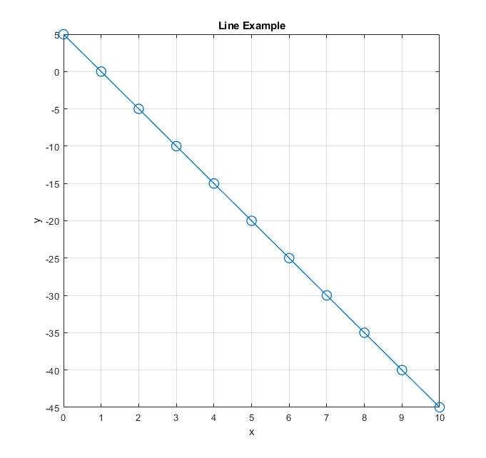
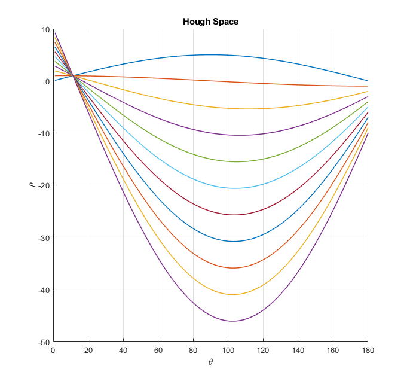

# Lane_Detection_tutorial
This tutorial teaches the basics on lane detection algorithm. Every image 
processing pipeline is slightly different, however, this should serve as a 
guideline for your future algorithm. 

## Image Gray scale
Most of the work involving lane detection doesn't need the colour information as there is a clear contrast between the line and the road.
Therefore we can apply a gray scale transform: 
$$G_xy = {(R_{xy}+G_{xy}+B_{xy}) \over 3}$$
Where (x,y) represents the pixel location.

<figure>
  
  <figcaption>Gray Scale image</figcaption>
</figure>

## ROI cropping
ROI (Region of Interest) is the area we are interesting in performing  part or all of our image processing pipeline.  
In the case of our road, the main region is the bottom half of the image as it contains road information. We can extend this further on only look ahead. This will allow us to filter unwanted noise. 
<figure>
  
  <figcaption>ROI Mask</figcaption>
</figure>
Matlab  will return  

## Birds Eye View or Homomorphic Mapping

Depending on your application it might be easier to visualize the road as if you were looking from above.  
Given:

$$
s =\begin{bmatrix}x_{1}\\
y_{1}\\
1 
\end{bmatrix}, d = \begin{bmatrix}x_{2}\\
y_{2}\\
1 
\end{bmatrix}
$$

Source $s$ and destination $d$ (the extra dimension is to be able to perform translation and rotation using Matrix Multiplication)

$$

\begin{bmatrix}
x_1\\
y_1\\
1
\end{bmatrix}
 =
 A
\begin{bmatrix}
x_2\\
y_2\\
1
\end{bmatrix}
,
A =
\begin{bmatrix}
    a_{00} & a_{01} & a_{02} \\
    a_{10} & a_{11} & a_{12} \\
    a_{20} & a_{21} & a_{22}
\end{bmatrix}

$$

<figure>
  
  <figcaption>Projection Mapping applied on ROI</figcaption>
</figure>

You can see that the lines are almost parallel and this is almost like having a birds eye view of the road.   
This implementation is a bit crude and  you can see it is not perfect. Mathwords has a tutorial that you can find [here](https://uk.mathworks.com/help/driving/ref/birdseyeview.html). The results are surprinsingly good but that requires knowledge of some of the camera attributes (such as focal length, positining, etc.). 

## Hough Transform

In a Cartesian plane, lines are represented by the formula $y = ax + b$ with $a$ representing the slope and $b$ the $y-axis$ intersection. As such, lines can be defined as tuple containing both of these parameters: $(a,b)$. However, for vertical lines, in the form of $x = c$ with $c \in \mathbb{R}$, such notation is not applicable, as the slope would be infinite (undefined).  
\par An alternative way of representing lines is defining them in terms of $\rho$ and $\theta$ as seen 

<figure>
  
  <figcaption>Projection Mapping applied on ROI</figcaption>
</figure>

With $\rho$ representing the distance of shortest line spanning from the origin (blue) to desired line (red) and $\theta$ between the $a-axis$ and the aforementioned shortest line, the relationship between the pairs $(a,b)$ and $(\rho, \theta)$ can be inferred from Figure \ref{fig:cartesian} as $\frac{\rho}{b} = \sin(\theta) \Leftrightarrow \frac{1}{b} = \frac{\sin(\theta)}{\rho}$ and $\frac{\rho}{b}a = \cos(\theta) \Leftrightarrow \frac{a}{b} = \frac{\cos(\theta)}{\rho}$. Finally, the equation $y =ax-b$ can be rewritten as $\frac{y}{b}+\frac{a}{b} = 1$ resulting in, after substitution, $\rho = x\cos(\theta) + y\sin(\theta)$

<figure>

  
   

<figurecaption> HoughSpace </figurecaption>
</figure>